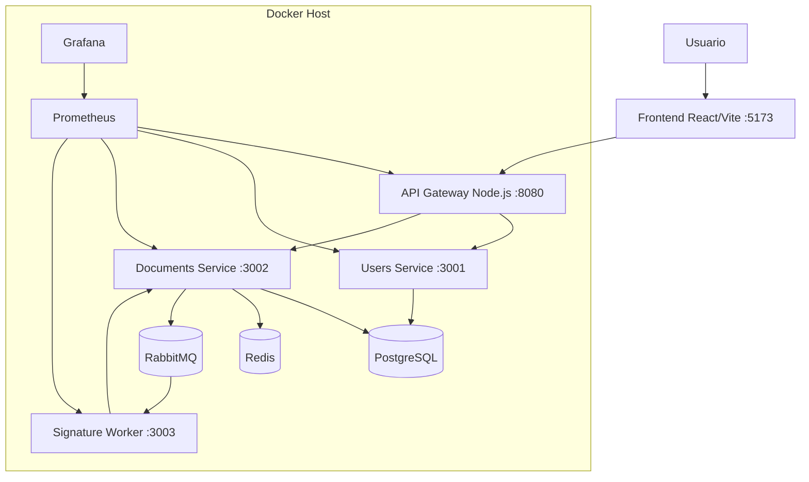

# EcoFirma: documentación de arquitectura y despliegue

## Ecosistema de aplicaciones

EcoFirma queda compuesto por estas aplicaciones y servicios:

1. Frontend React/Vite: interfaz web para registro, login, gestión documental y solicitud de firma.
2. API Gateway Node.js: punto único de entrada REST para usuarios, documentos y firma.
3. Users Service: registro, login, hash de contraseña con bcrypt y emisión de JWT.
4. Documents Service: CRUD documental, cache-aside con Redis y publicación de eventos a RabbitMQ.
5. Signature Worker: función tipo Lambda/server function que consume mensajes y procesa firmas asíncronas.
6. PostgreSQL: capa de datos relacional para usuarios y documentos.
7. Redis: caché distribuida.
8. RabbitMQ: gestor de colas AMQP.
9. Prometheus/Grafana: monitoreo y dashboards.

## Patrones aplicados

- Microservicios: separación entre identidad, documentos, gateway y firma.
- API Gateway: centralización de exposición REST.
- Cache-Aside: Documents Service consulta Redis antes de PostgreSQL.
- Repository/Data Access simplificado: acceso a datos encapsulado en el servicio documental.
- Mensajería asíncrona: RabbitMQ desacopla la firma del flujo HTTP.
- Serverless/Lambda style: Signature Worker modela una función activada por eventos.
- Health checks y monitoreo: cada servicio expone estado y métricas.

## Diagrama de despliegue

## Análisis requerido

### Caché

Documents Service implementa Cache-Aside con Redis. Las lecturas de lista y detalle consultan Redis primero; si hay cache miss, consultan PostgreSQL y repueblan la caché. En creación, actualización, eliminación y cambio de estado se invalida la caché.

### Balanceo

La solución es compatible con balanceo horizontal porque los servicios HTTP son stateless. En producción, el API Gateway puede ubicarse detrás de Nginx, Traefik, un balanceador cloud o Kubernetes Ingress.

### Indexación

Se recomienda indexar `users.email`, `documents.autor_id`, `documents.estado` y `documents.created_at`. El índice de email ya está cubierto por la restricción UNIQUE.

### Redundancia

Los servicios pueden levantarse en múltiples réplicas. PostgreSQL debe respaldarse con backups y réplicas de lectura. RabbitMQ mantiene eventos pendientes si el worker cae temporalmente.

### Disponibilidad

Docker Compose usa healthchecks y políticas `restart: unless-stopped`. El procesamiento de firma está desacoplado; si el worker no está disponible, el sistema puede seguir registrando usuarios y documentos.

### Concurrencia

Los servicios HTTP pueden atender múltiples solicitudes concurrentes. RabbitMQ controla la concurrencia del worker mediante `prefetch(1)` y ack manual, evitando pérdida de mensajes.

### Latencia

Redis reduce latencia en lecturas frecuentes. RabbitMQ reduce la latencia percibida porque la firma responde con `202 Accepted` y continúa en segundo plano.

### Costo y proyección

La solución puede iniciar en un solo Docker Host. En crecimiento, Redis, PostgreSQL, RabbitMQ y el worker pueden migrarse a servicios administrados. El modelo tipo Lambda reduce costo para cargas esporádicas de firma.

### Performance y escalabilidad

Documents Service, Users Service, Gateway y Signature Worker escalan de forma independiente. Ante picos de firma, se aumentan consumidores de RabbitMQ; ante picos de lectura, se escala Documents Service y Redis.

## CI/CD

El repositorio incluye workflows de GitHub Actions:

- CI: lint, tests, build de imágenes y smoke test con Docker Compose.
- CD: build/push de imágenes a GHCR y despliegue vía SSH.
- Security: npm audit y escaneo Trivy de imágenes Docker.

## Monitoreo

Prometheus recolecta métricas de Gateway, Users Service, Documents Service, Signature Worker, PostgreSQL, Redis y RabbitMQ. Grafana carga dashboards desde `monitoring/grafana`.

## Demo mínima

1. Copiar `.env.example` a `.env`.
2. Ejecutar `docker compose up --build`.
3. Abrir `http://localhost:5188`.
4. Registrar usuario.
5. Iniciar sesión.
6. Crear documento.
7. Solicitar firma.
8. Consultar estado hasta `FIRMADO`.
